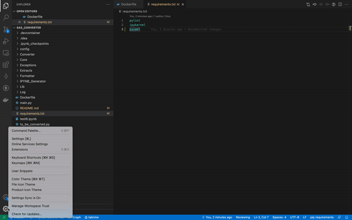

# pytest-tutorial
Understand basic settings required to perform Pytest and Score your Python Code

# Pre Requisites
### Following needs to be installed
1. Docker
    * for [Windows](https://docs.docker.com/desktop/windows/install/)
    * for [Mac](https://docs.docker.com/desktop/mac/install/)
2. VS Code
    * [Download link](https://code.visualstudio.com/download)

# Steps
1. Clone this repository 
```
git clone git@github.com:FactspanInc/pytest-tutorial.git
```

2. Switch to main branch
```
git checkout main
```

3. Extensions>> search for remoteContainer extension and install it >> click re-open in container >> From Dockerfile



4. Run follwing commands

>> pylint - Runs pylint for all the files inside project folder
```
make pylint
```

>> pytest - Runs all the pytest files inside tests folder
```
make pytest
```
>> code coverage - get the code coverage report for all files inside project folder
```
make coverage
```


Happy Coding :smile:
